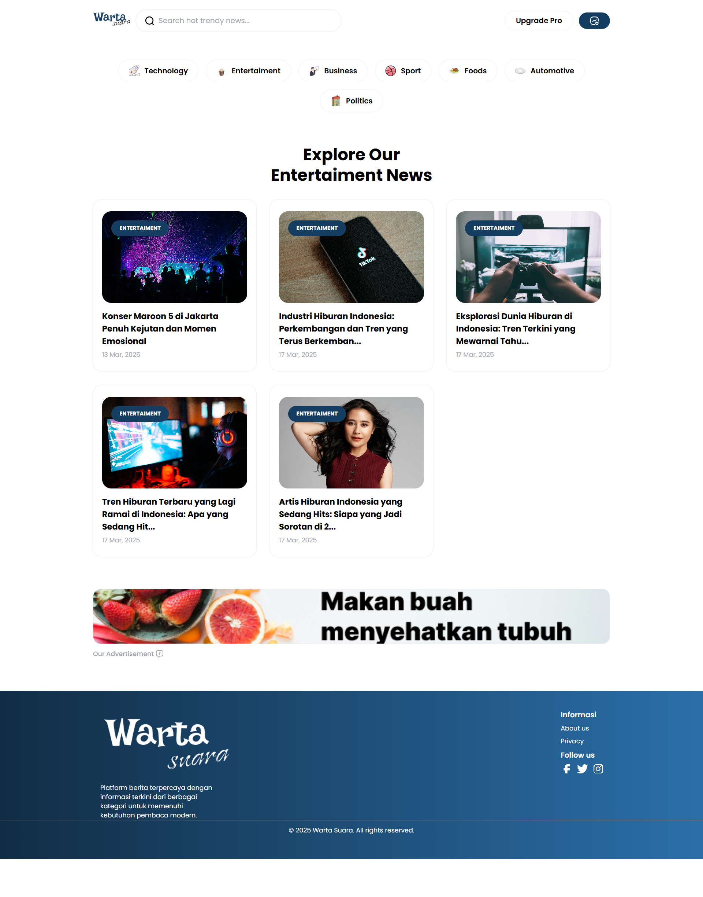
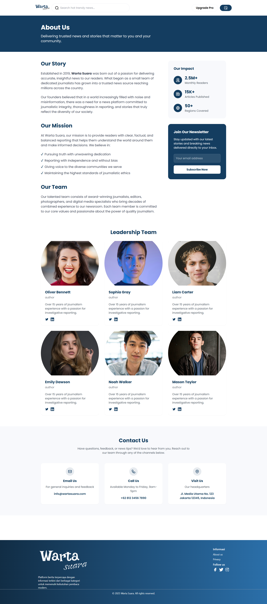
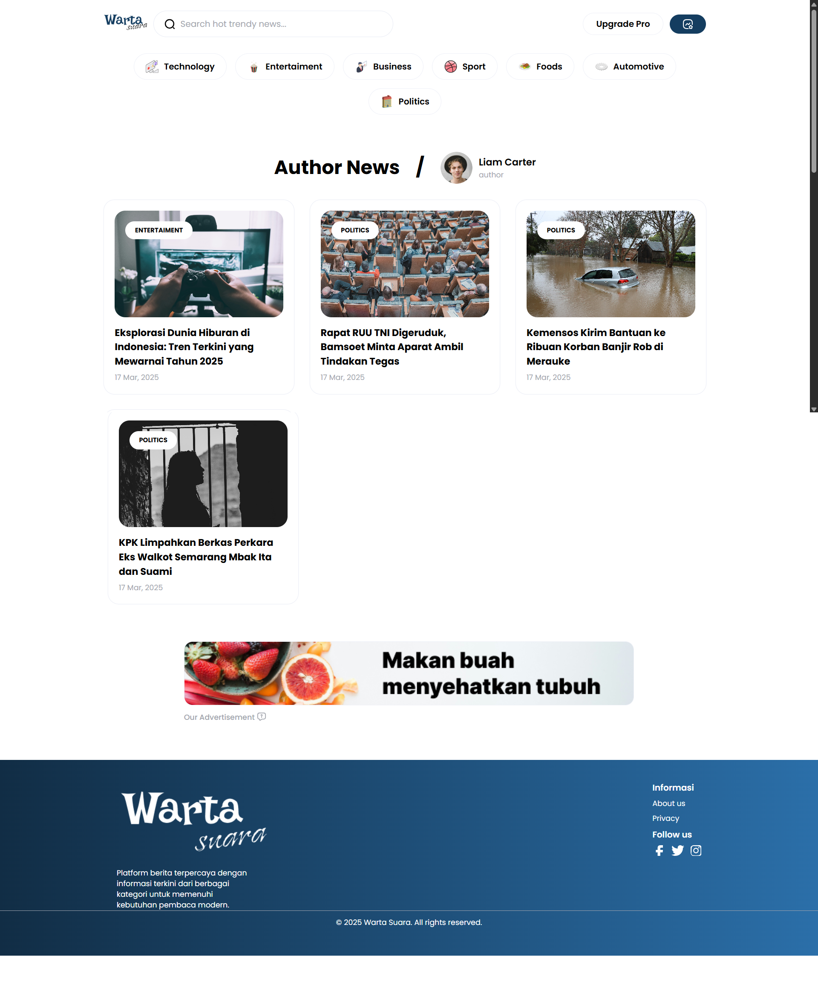
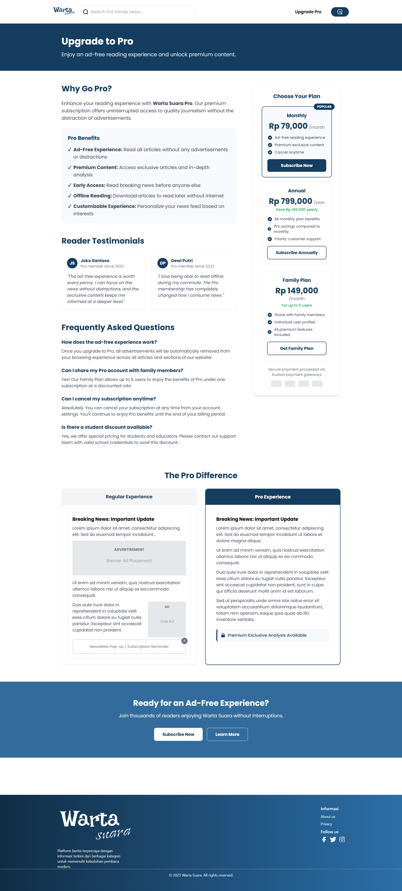

## About Warta Suara

Warta Suara is a digital news portal that serves as a trusted source of information for the people of Indonesia. By presenting a variety of news categories ranging from politics, business, sports, to entertainment, this portal is committed to providing actual, factual, and balanced content to its readers. Warta Suara journalists work hard every day to bring in-depth coverage and sharp analysis of important events, so that the public can gain a comprehensive understanding of current issues. The presence of Warta Suara is a bridge of information that connects events from various regions and abroad to readers, which can be relied upon in the midst of a dynamic information era.

## Menu & Features
- Home
- Detail article
- Author
- Category
- About Us
- Upgrade

## Screenshot Warta Suara

### Website

<!-- - home 
- article 
- category 
- about 
- author 
- upgrade  -->

| Halaman    | Pratinjau |
|------------|-----------|
| **Home**      |  |
| **Article**   |  |
| **Category**  |  |
| **About**     |  |
| **Author**    |  |
| **Upgrade**   |  |

### Mobile
